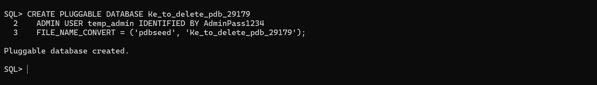
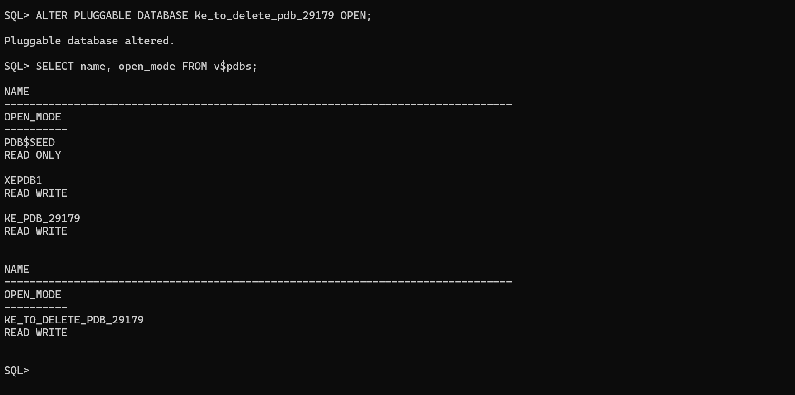
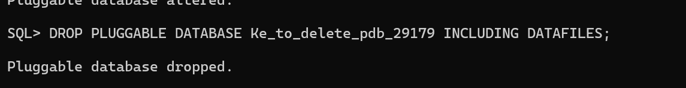
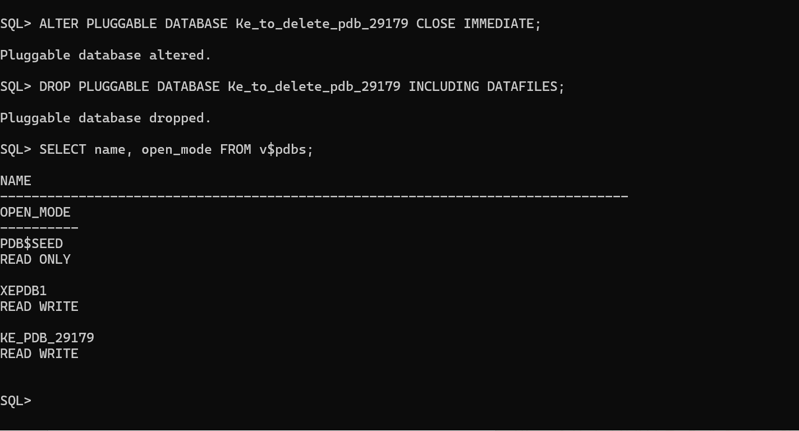
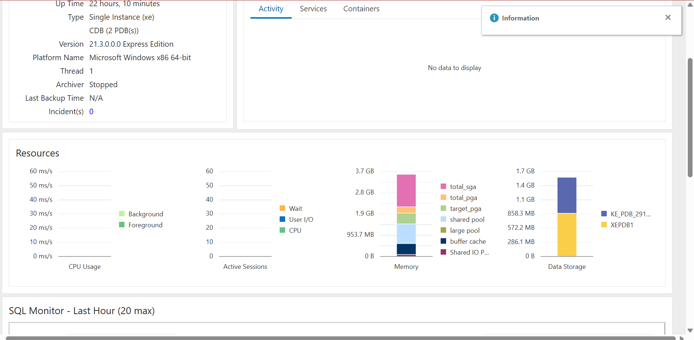
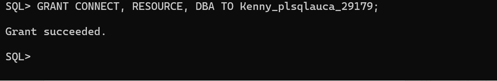
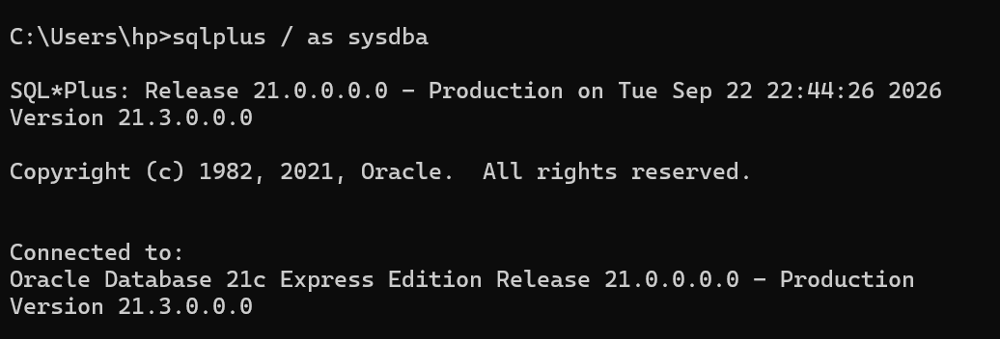

# Oracle PDB Management Assignment

## Student Information

* **Name:** Ruhumuriza Yvan Kenny
* **Student ID:** 29179
* **Course:** INSY 8311 - Database Development with PL/SQL
* **Date:** September 23, 2026

---

## Overview

This assignment demonstrates practical Oracle Multitenant Architecture operations using Oracle Database 21c Express Edition. The activities include creating and managing a Pluggable Database (PDB), creating and deleting a temporary PDB, managing database users and privileges, and accessing Oracle Enterprise Manager.

The assignment also documents an administrative privilege issue encountered during the practical work and the solution used to resolve it.

---

## Oracle Environment

* **Database:** Oracle Database 21c Express Edition (21.3.0.0.0)
* **Operating System:** Windows 11
* **Tools:** SQL*Plus, Oracle Enterprise Manager

---

# Task 1: Create the Main PDB

### PDB Information

* **PDB Name:** `PDB_Ke_PDB_29179`
* **Administrative User:** `Kenny_PLSQL_29179`

### Commands

```sql
CREATE PLUGGABLE DATABASE PDB_Ke_PDB_29179
ADMIN USER Kenny_PLSQL_29179 IDENTIFIED BY 12345
FILE_NAME_CONVERT = ('pdbseed', 'PDB_Ke_PDB_29179');

ALTER PLUGGABLE DATABASE PDB_Ke_PDB_29179 OPEN;

GRANT CONNECT, RESOURCE, DBA
TO Kenny_PLSQL_29179;
```

### Verification

The PDB was successfully created and opened in **READ WRITE** mode. The administrative user was also verified after creation.

### Evidence

#### PDB Creation


#### PDB Open Status


#### User Verification


---

# Task 2: Create and Delete a Temporary PDB

## Temporary PDB Information

* **Temporary PDB:** `Ke_TEMP_PDB_29179`
* **Administrative User:** `ke_TEMP_PDB_29179`

### Create the Temporary PDB

```sql
CREATE PLUGGABLE DATABASE ke_TEMP_PDB_29179
ADMIN USER ke_TEMP_PDB_29179 IDENTIFIED BY 12345
FILE_NAME_CONVERT = ('pdbseed', 'Ke_TEMP_PDB_29179');
```

### Close the Temporary PDB

Before deleting the PDB, it was closed using:

```sql
ALTER PLUGGABLE DATABASE AD_TEMP_PDB_29179 CLOSE IMMEDIATE;
```

### Delete the Temporary PDB

The temporary PDB was then removed together with its associated datafiles:

```sql
DROP PLUGGABLE DATABASE Ke_TEMP_PDB_29179 INCLUDING DATAFILES;
```

### Verification

The screenshots demonstrate:

1. Successful creation of the temporary PDB.
2. Both the main and temporary PDBs appearing in the database.
3. Successful deletion of the temporary PDB.
4. Verification that the temporary PDB no longer exists.

### Evidence

#### Temporary PDB Creation



#### Both PDBs


#### PDB Deletion



#### Deletion Verification


---

# Task 3: Oracle Enterprise Manager

Oracle Enterprise Manager was accessed through:

**https://localhost:5500/em**

The database was accessed using the **SYS** account with **SYSDBA** privileges.

The Enterprise Manager dashboard was used to verify the Oracle database environment and PDB status.

### Evidence


---

# Challenges and Solutions

## Issue: Insufficient Privileges

During the practical session, an **"Insufficient privileges"** error occurred while attempting to open the PDB.

### Error Evidence



### Solution

The issue was resolved by reconnecting to Oracle using a SYSDBA connection:

```sql
sqlplus / as sysdba
```

After reconnecting with the required administrative privileges, the PDB management operations could be performed successfully.

### Solution Evidence



### Lesson Learned

This issue demonstrated the importance of checking the current Oracle connection and privileges before performing administrative operations such as opening, closing, creating, or dropping PDBs.

---

# Summary

The practical exercise provided hands-on experience with Oracle Multitenant Architecture. The following operations were successfully demonstrated:

* Creation of a main Pluggable Database.
* Creation of an administrative database user.
* Granting database privileges to the user.
* Opening the PDB in READ WRITE mode.
* Creation of a temporary PDB.
* Closing a PDB before deletion.
* Dropping a PDB including its datafiles.
* Verification of PDB status and existence.
* Accessing Oracle Enterprise Manager.
* Troubleshooting an insufficient-privileges error by using a SYSDBA connection.

---

# Academic Integrity Statement

I, **Ruhumuriza Yvan Kenny, ID: 29179**, declare that the practical work represented in this report is based on my own database activities, commands, and evidence. The screenshots and results included in this documentation are intended to represent the work performed in the Oracle environment.
